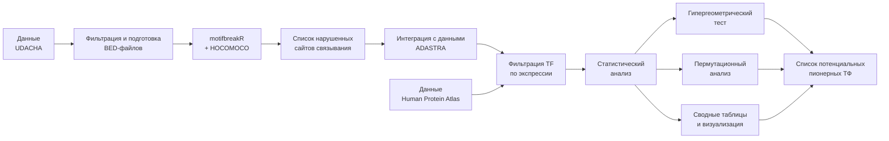

# Diploma
Текст дипломной работы: https://docs.google.com/document/d/1o2yvjVYyHsSSNWKe-q8pB1RBUOX3xlwiG2k8Mcjq1ok/edit?tab=t.0
## Схема пайплайна

```mermaid
flowchart LR
    A["Данные<br/>UDACHA"] --> B["Фильтрация и подготовка<br/>BED-файлов"]
    B --> C["motifbreakR<br/>+ HOCOMOCO"]
    C --> D["Список нарушенных<br/>сайтов связывания"]
    D --> E["Интеграция с данными<br/>ADASTRA"]
    E --> F["Фильтрация TF<br/>по экспрессии"]
    G["Данные<br/>Human Protein Atlas"] --> F
    F --> H["Статистический<br/>анализ"]
    H --> I["Гипергеометрический<br/>тест"]
    H --> J["Пермутационный<br/>анализ"]
    H --> K["Сводные таблицы<br/>и визуализация"]
    I --> L["Список потенциальных<br/>пионерных ТФ"]
    J --> L
    K --> L
```

