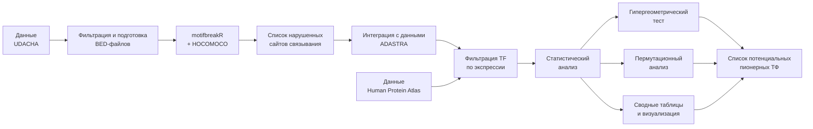
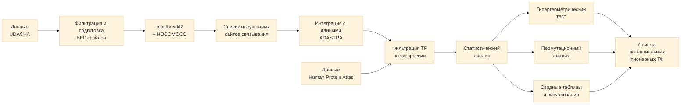

# Diploma
## Схема пайплайна

```mermaid
flowchart LR
    A["Данные<br/>UDACHA"] --> B["Фильтрация и подготовка<br/>BED-файлов"]
    B --> C["motifbreakR<br/>+ HOCOMOCO"]
    C --> D["Список нарушенных<br/>сайтов связывания"]
    D --> E["Интеграция с данными<br/>ADASTRA"]
    E --> F["Фильтрация TF<br/>по экспрессии"]
    G["Данные<br/>Human Protein Atlas"] --> F
    F --> H["Статистический<br/>анализ"]
    H --> I["Гипергеометрический<br/>тест"]
    H --> J["Пермутационный<br/>анализ"]
    H --> K["Сводные таблицы<br/>и визуализация"]
    I --> L["Список потенциальных<br/>пионерных ТФ"]
    J --> L
    K --> L
```

```mermaid
%%{init: {
  "theme": "base",
  "themeVariables": {
    "fontSize": "20px",
    "fontFamily": "Arial"
  },
  "flowchart": {
    "nodeSpacing": 70,
    "rankSpacing": 90
  }
}}%%

flowchart LR
    A["Данные<br/>UDACHA"] --> B["Фильтрация и подготовка<br/>BED-файлов"]
    B --> C["motifbreakR<br/>+ HOCOMOCO"]
    C --> D["Список нарушенных<br/>сайтов связывания"]
    D --> E["Интеграция с данными<br/>ADASTRA"]
    E --> F["Фильтрация TF<br/>по экспрессии"]
    G["Данные<br/>Human Protein Atlas"] --> F
    F --> H["Статистический<br/>анализ"]
    H --> I["Гипергеометрический<br/>тест"]
    H --> J["Пермутационный<br/>анализ"]
    H --> K["Сводные таблицы<br/>и визуализация"]
    I --> L["Список потенциальных<br/>пионерных ТФ"]
    J --> L
    K --> L

    classDef big font-size:20px,stroke-width:2px;
    class A,B,C,D,E,F,G,H,I,J,K,L big;
```

