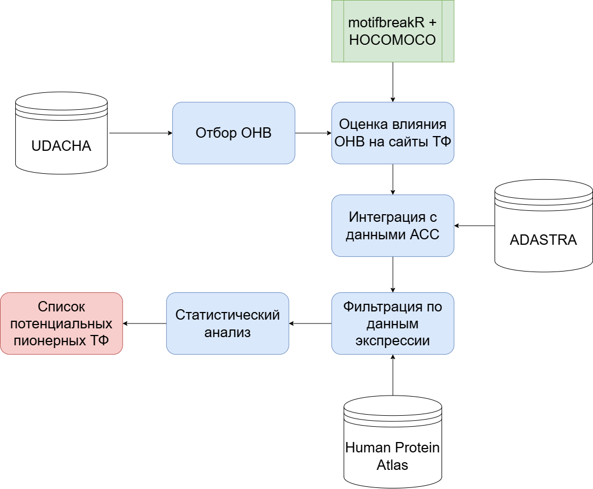

# Идентификация пионерных транскрипционных факторов
Текст дипломной работы: https://docs.google.com/document/d/1o2yvjVYyHsSSNWKe-q8pB1RBUOX3xlwiG2k8Mcjq1ok/edit?tab=t.0
## Схема пайплайна


## Установка окружения 
### Вариант через conda
```Python3
conda create -n diploma python=3.10 r-base=4.3 -y
conda activate diploma
conda install -c conda-forge pandas numpy scipy matplotlib seaborn bedtools -y
```

### Установка motifbreakR и зависимостей в R
```R
if (!requireNamespace("BiocManager", quietly = TRUE))
    install.packages("BiocManager")

BiocManager::install(c(
    "motifbreakR",
    "TFBSTools",
    "MotifDb",
    "GenomicRanges",
    "IRanges",
    "rtracklayer"
))
```
### Установка пакета генома (hg38)
```R
BiocManager::install("BSgenome.Hsapiens.UCSC.hg38")
```

### Анализ экспрессии 
Для правильной работы необходимо установить данные из базы данных Human Protein Atlas
```bash
# Создание папки для данных Human Protein Atlas
mkdir -p HPA
cd HPA

# Tissue RNA consensus
wget -c https://www.proteinatlas.org/download/tsv/rna_tissue_consensus_tissues.tsv.zip

# Brain RNA data
wget -c https://www.proteinatlas.org/download/tsv/rna_brain_region_hpa.tsv.zip
wget -c https://www.proteinatlas.org/download/tsv/rna_brain_hpa.tsv.zip
wget -c https://www.proteinatlas.org/download/tsv/rna_pfc_brain_hpa.tsv.zip

# Single cell RNA data
wget -c https://www.proteinatlas.org/download/tsv/rna_single_cell_type.tsv.zip
wget -c https://www.proteinatlas.org/download/tsv/rna_single_cell_type.group.tsv.zip

# Immune cell RNA data
wget -c https://www.proteinatlas.org/download/tsv/rna_immune_cell.tsv.zip

# Cell line RNA data
wget -c https://www.proteinatlas.org/download/tsv/rna_cell_line_cancer.tsv.zip
wget -c https://www.proteinatlas.org/download/tsv/rna_celline.tsv.zip

# Распаковка архивов
unzip -o "*.zip"

# Переименование файла HPA под имя, используемое в проекте
mv rna_single_cell_type.group.tsv rna_single_cell_type_group.tsv

# Проверка результата
ls -lh *.tsv
```
